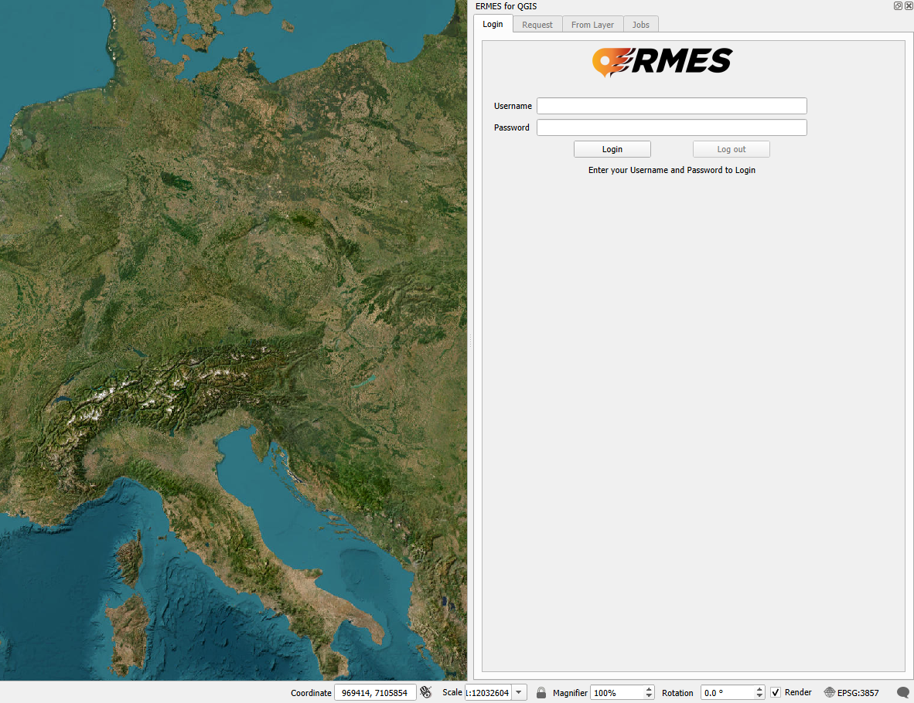

# QGIS ERMES Connector plugin

A QGIS plugin to integrate with the ERMES Earth Observation (EO) platform from Links Foundation. Request and automatically load on-demand emergency maps directly as QGIS layers.

## About the Plugin
The ERMES Connector provides a direct bridge between the QGIS desktop environment and the ERMES Earth Observation (EO) processing platform. It enables GIS analysts, researchers, and emergency managers to task powerful remote EO models for crisis management and environmental analysis without leaving their GIS workspace.
The workflow is simple: define an area of interest, select a processing pipeline, and send the request. The plugin works asynchronously in the background, listening for the result and automatically downloading and loading the final map into your QGIS project upon completion.

## Usage Guide

The ERMES Connector plugin provides four main tabs for different functionalities:

### 1. Login Tab

**Purpose**: Authenticate with the ERMES platform to access processing services.

**How to use**:
- Fill in your username and password in the provided fields
- Click the "Login" button to authenticate
- If you don't have an account, contact the administrator to request account creation
- Once logged in, you'll have access to all other plugin functionalities

### 2. Request Tab

**Purpose**: Request new processing jobs by defining an area of interest and processing parameters.

**How to use**:
- **Layer Type**: Select the type of analysis you want to perform from the dropdown menu (e.g., Burned area delineation, Active Flames and Smoke detection, Waterbody delineation, etc.)
- **AOI (Area of Interest)**: Choose a polygon layer from your QGIS project that defines the area you want to analyze
- **Time Range**: Select the start and end dates for your analysis period using the date picker or calendar widget
- **Cloud Cover**: Adjust the maximum cloud cover percentage using the slider (for satellite imagery requests)
- Click "Get Layer" to submit your request
- Monitor the status updates in the text logger at the bottom
- The requested layer will be automatically uploaded to QGIS once processing is complete

### 3. From Layer Tab

**Purpose**: Compute analysis layers starting from existing Sentinel-1 or Sentinel-2 imagery in your QGIS project.

**How to use**:
- **Raster Layer**: Select a Sentinel-1 or Sentinel-2 image layer from your QGIS project
- **Image Type**: Choose whether you're working with Sentinel-1 or Sentinel-2 imagery
- **Output Layer**: Select the type of analysis you want to perform on the selected imagery (e.g., Burned area delineation, Burn Severity estimation, Waterbody delineation)
- Click "Get Layer" to start the processing
- Monitor progress in the text logger
- The computed layer will be automatically added to your QGIS project when ready

### 4. Job History Tab

**Purpose**: Monitor and manage your past processing jobs and download completed results.

**How to use**:
- View a table of all your submitted jobs
- **Refresh**: Click to update the job list with the latest status information
- **Download Selected**: Download completed layers that haven't been automatically loaded
- **Delete Selected**: Remove completed jobs from your history (if enabled)

## Getting Started

1. **Install the Plugin**: Install the ERMES Connector plugin through the QGIS Plugin Manager
2. **Login**: Use the Login tab to authenticate with your ERMES account
3. **Prepare Your Data**: Ensure you have the necessary polygon layers (for Request tab) or Sentinel imagery (for From Layer tab) loaded in your QGIS project
4. **Submit Requests**: Use either the Request or From Layer tab to submit processing jobs
5. **Monitor Progress**: Check the Job History tab to track the status of your requests
6. **Access Results**: Completed layers will be automatically loaded into your QGIS project